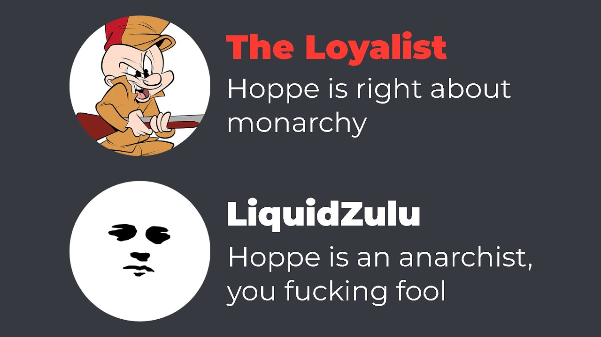

# Table of Contents

1.  [Notes](#org6e2ffc7)
2.  [Flow <code>[9/9]</code>](#org1ffe1ce)
3.  [End Sceen](#org2510323)

# Notes

-   all libertarians favour property rights and agree that these rights include rights in tangible resources
-   all libertarians support a property rights in oneself
-   rights to a reputation and so forth is very intangible, libertarianism is opposed to blackmail.
-   suppose A invents a mousetrap with a new type of spring that can better trap mice, B invents a mousetrap with a non-stick coating that allows for the easier removal of mouse remains. In such a situation if both A and B patent their creations we are left with a scenario where neither may use the others innovation, and nobody is allowed to produce a mousetrap with both improvements unless A and B cross-license
-   IP is a claim to a property right in an ideal object which then transmutes into any physical instantiation of said object.
-   an IP gives control to the IP holder over the property of other
-   could be the case that more would be spent on research if less needed to be spent on attaining and defending in court the various forms of IP&#x2014;it could be the case that companies have an even greater incentive to innovate if they could not simply sit on a prior innovation without competition.
-   if it was the case that one may have property in ideas then does this property right pass to ones heirs like all other property rights?
-   There exists no clear line between creation and discovery, the inventor of a new mousetrap with superior performance simply rearranges matter, others who learn of this may re-arrange matter in the same way. Similarly Einsteins discovery of $E=mc^2$, allowed him to re-arrange matter in new ways, and others upon hearing of this formula may do the same. Does it make sense to say that Einstein discovered a law of nature and the inventor created something not extant in nature when the mousetrap still adheres to those natural laws?
-   Property only matters in scarce means, as it is only where there is scarcity there can be conflicts and property rights are conflict avoiding norms.
-   creation is not the source of property; a theif who creates something new with the materials of another does not own the creation.

# Flow <code>[9/9]</code>

-   [X] What forms of IP are valid?
    -   both coopyrights and patents
    -   i.e. patents vs copyright, mention the flimsy distinction between discovery and creation if patents are allowed.
    -   What would your ideal IP system look like?
-   [X] Can I pass an intellectual property onto my children?
    -   no longer novel
-   [X] if two men simultaneously come up with some new IP who has ownership over the IP?
-   [X] Can I trade an intellectual property?
-   [X] How can there be property rights in ideas if ideas are not scarce?
    -   creation of value
        -   give an example
            -   what is a property right
            -   if someone just made an idea it would be worse to take this than an old idea
-   [X] (only if he says patents would lead to some sort of economic goodies or whatever) Given that the existence of patents diverts production towards patentable inventions, how can this be said?
    -   innovation
-   [X] Production isnt really making new property, its simply re-arranging previously appropriated property, go into the over-emphasis on creation and how it lead to the LTV
-   [X] A discovers oil well under the ground and wants to buy his neighbors properties, but one neighbor B trespasses and discovers A&rsquo;s plan and tells everyone about it. Can A force his neighbors to sell at the lower price they would have agreed to had they not known about the oil well.
-   [X] can you patent e=mc2
-   more innovation with IP?
    -   industrial revolution would not have happened without IP

# End Sceen

<https://www.youtube.com/watch?v=4_aghrwcW6Q>

